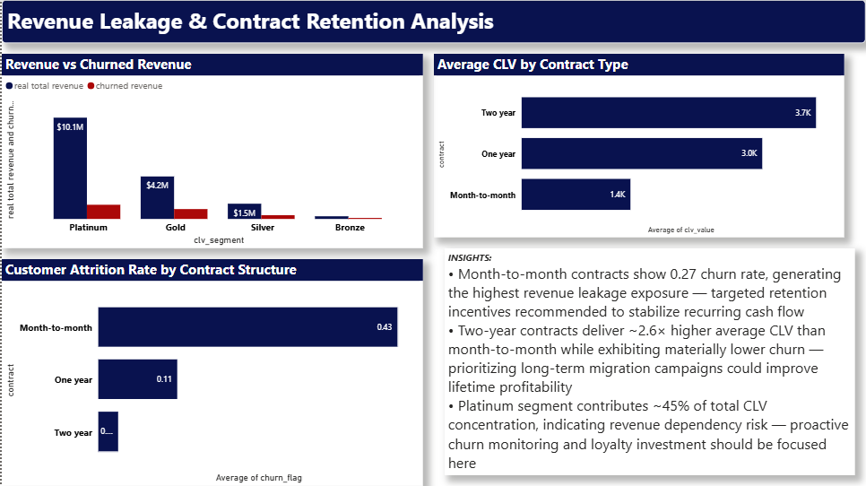
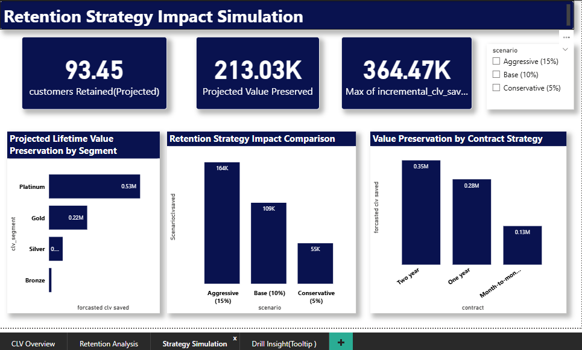

Customer Lifetime Value & Churn Analytics

End-to-end customer value analytics workflow integrating data engineering, financial modeling, and executive dashboarding.

---

Overview

This project implements a full analytics pipeline designed to quantify customer value, identify churn exposure, and simulate retention strategy impact using SQL transformation, Excel scenario modeling, and Power BI visualization.

---

Architecture Overview

---

Dataset

IBM Telco Customer Churn
Source: https://www.kaggle.com/datasets/blastchar/telco-customer-churn

---

Business Objective

Organizations experience revenue leakage due to customer attrition.
This project builds a decision-support workflow to:

- Segment customers by lifetime value
- Quantify churn exposure
- Estimate recoverable revenue
- Model retention strategy ROI

---

Tech Stack

- SQL — Data cleaning, feature engineering, segmentation
- Excel — Scenario modeling and forecast simulation
- Power BI — Executive decision dashboard
- GitHub — Version control and documentation

---

Analytical KPI Framework

KPI| Definition| Business Relevance
Customer Lifetime Value (CLV)| Monthly Charges × Estimated Lifetime Months| Measures long-term customer profitability
Churn Rate| % of customers who discontinued service| Indicates retention health
Revenue at Risk| CLV of churned customers| Quantifies financial exposure
Segment Value Tier| Quartile-based CLV segmentation| Enables prioritization of resources
Incremental CLV Saved| CLV retained under scenario simulation| Measures strategy impact

---

Pipeline Workflow

1. Raw dataset ingestion and validation
2. Data cleaning and feature engineering via SQL
3. CLV proxy computation
4. Quartile-based segmentation
5. Churn concentration analysis
6. Revenue exposure estimation
7. Retention scenario simulation in Excel
8. Dashboard storytelling via Power BI

---

Analytical Walkthrough

1. Telco dataset ingested and validated
2. SQL transformations applied for feature engineering
3. CLV proxy computed and segmented into quartiles
4. Excel used to simulate retention impact scenarios
5. Power BI dashboards built for diagnostic exploration
6. Revenue exposure and recovery potential visualized
7. Strategic insights derived for cohort targeting

---

Analytical Techniques Applied

- Window-based aggregation for segmentation logic
- Quartile distribution modeling
- Revenue exposure quantification
- Scenario-based financial simulation
- KPI-driven dashboard storytelling

---

Key Analytical Outcomes

- Customer base segmented into four CLV tiers
- Churn risk concentration identified in low-value cohorts
- Revenue exposure quantified by contract structure
- Retention strategies modeled for incremental CLV recovery

---

Dashboard Highlights

- Segment value distribution
- Churn rate diagnostics
- Revenue vs churn loss comparison
- Retention strategy impact simulation

## Dashboard Screenshots

### CLV Overview

### Retention Analysis

### Strategy Simulation

### Tooltip Detail

---

Financial Impact Modeling

This project quantifies revenue exposure and evaluates retention ROI through scenario simulation.

- Identified high-risk revenue concentration within low-tenure cohorts
- Estimated recoverable value through churn reduction scenarios
- Modeled incremental CLV preservation for strategic targeting
- Enables prioritization based on economic impact rather than churn volume

---

Repository Structure

data/      → Source dataset  
sql/       → Data engineering scripts  
excel/     → Forecast model  
powerbi/   → Dashboard file  
images/    → Visualization screenshots  

---

## Business Impact Summary

This project applies Customer Lifetime Value (CLV) forecasting to support
data-driven retention and profitability decisions.

- Forecasts customer value trajectories to quantify long-term revenue potential
- Identifies value-at-risk through churn probability and contract segmentation
- Evaluates retention scenarios based on incremental CLV preservation
- Enables prioritization of high-impact customer segments using economic value signals

---

Reproducibility

To replicate this project:

1. Download dataset from Kaggle
2. Execute SQL script in '/sql/'
3. Open Excel model in '/excel/'
4. Load dataset into Power BI file in '/powerbi/'
5. Refresh visuals

All required assets are included in the repository.

---

