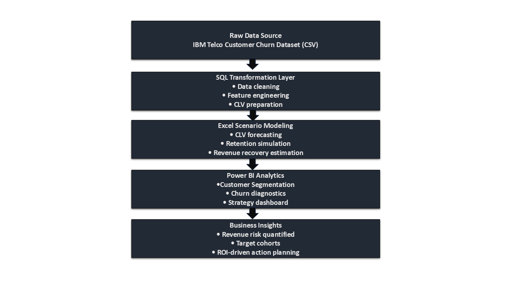
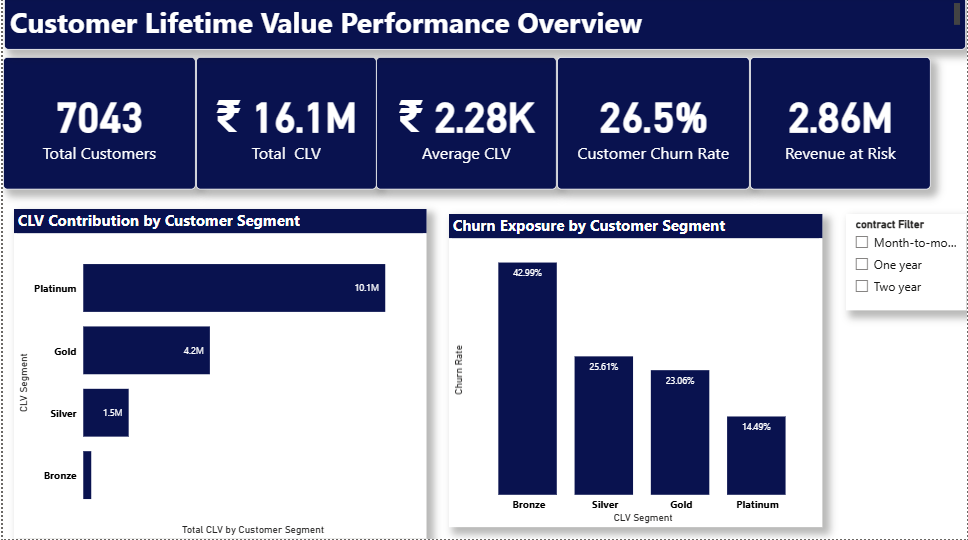
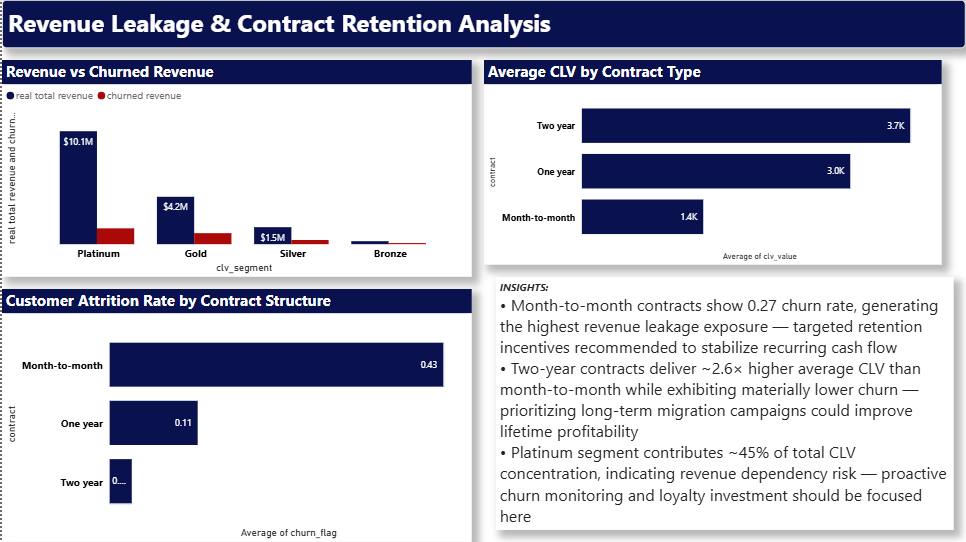
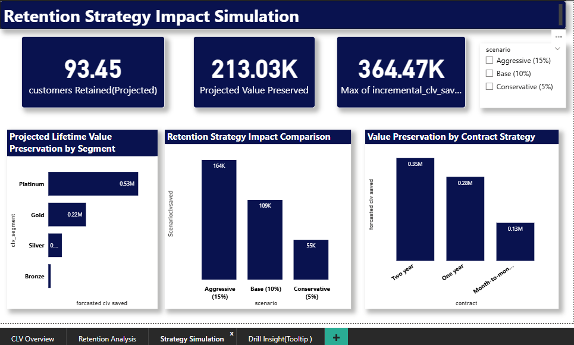
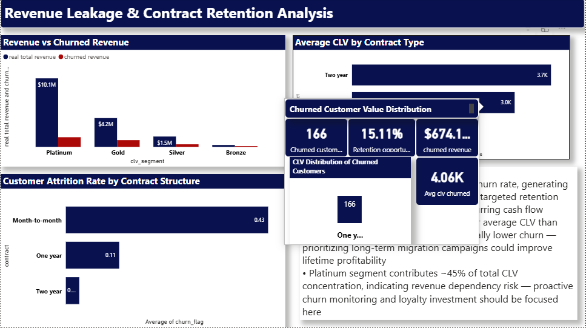

# Customer Lifetime Value & Churn Analytics
**SQL · Excel · Power BI**

An end-to-end analytics pipeline to quantify customer value, identify churn exposure, and simulate retention strategy ROI — built on the IBM Telco Customer Churn dataset.

---

## The Problem

Telecom companies lose revenue not just because customers churn, but because most retention efforts treat all customers equally. A customer paying ₹800/month leaving is a fundamentally different problem from one paying ₹80/month leaving. This project builds a workflow to separate those two problems and act on them differently.

---

## Dataset

**IBM Telco Customer Churn**  
Source: [Kaggle](https://www.kaggle.com/datasets/blastchar/telco-customer-churn)  
7,043 customers · 21 columns · one row per customer

Key columns used: `customerID`, `tenure`, `monthly_charges`, `total_charges`, `contract`, `churn`

---

Architecture Overview


---
## Tech Stack

| Tool | Purpose |
|------|---------|
| SQL (MySQL) | Data cleaning, feature engineering, CLV computation, segmentation |
| Excel | Retention scenario modeling |
| Power BI | Executive dashboard — 3-page narrative |
| GitHub | Version control |

---

## What I Actually Built

### 1. Data Cleaning (SQL)
The raw dataset had one consistent issue: `total_charges` came in as a text column with 11 blank values — not nulls — for customers with zero tenure (brand new signups). Used `NULLIF` + `TRIM` before casting to decimal. These 11 customers were kept in the dataset; they ended up in the Bronze segment with a CLV of zero.

```sql
CAST(NULLIF(TRIM(total_charges), '') AS DECIMAL(10,2)) AS total_charges
```

### 2. CLV Computation (SQL)
Used a deterministic CLV proxy: **monthly_charges × tenure**. This measures realized historical revenue per customer — not a forward-looking prediction. The choice was intentional: for segmentation purposes, historical value is sufficient and easy to explain to a business audience.

```sql
(monthly_charges * tenure) AS clv_value
```

Total portfolio CLV: **₹16.1M** | Average CLV: **₹2,286/customer**

### 3. Segmentation (SQL — NTILE)
Segmented customers into four value tiers using `NTILE(4)` on CLV. Equal-sized quartiles of ~1,760 customers each.

```sql
NTILE(4) OVER (ORDER BY clv_value) AS quartile
```

| Segment | Customers | Avg CLV | Churn Rate |
|---------|-----------|---------|------------|
| Platinum | 1,760 | ₹5,714 | 14.49% |
| Gold | 1,761 | ₹2,396 | 23.06% |
| Silver | 1,761 | ₹859 | 25.61% |
| Bronze | 1,761 | ₹151 | 42.99% |

The inverse relationship between CLV and churn rate is the core finding — your highest-value customers are also your stickiest.

### 4. Revenue Exposure (SQL)
Summed CLV across churned customers (churn_flag = 1) to quantify revenue already lost.

- Churned customers: **1,869**
- Total CLV of churned customers: **₹2.86M**

### 5. Retention Scenario Model (Excel)
Built a scenario simulator with three churn reduction assumptions applied to Platinum and Gold segments only. Silver and Bronze were excluded — at an average CLV of ₹151 and ₹859, targeted retention spend is unlikely to be ROI-positive.

| Scenario | Churn Reduction | Incremental CLV Saved |
|----------|----------------|----------------------|
| Aggressive | 15% | ₹364K |
| Base | 10% | ₹213K |
| Conservative | 5% | ₹109K |

### 6. Power BI Dashboard (3 pages)
- **Page 1 — CLV Overview**: Segment value distribution, churn rate by tier, KPI cards
- 
- **Page 2 — Retention Analysis**: Revenue vs churned revenue by segment, churn by contract type, average CLV by contract
- 
- **Page 3 — Strategy Simulation**: Scenario comparison, projected CLV saved by segment and contract type
- 
- **Tooltip Detail
-
---

## Key Findings

**1. High-value customers churn less — but their churn is more expensive**  
Platinum has a 14.49% churn rate vs Bronze's 42.99%. But each Platinum churner costs ~38× more in lost CLV than a Bronze churner (₹5,714 vs ₹151 avg CLV).

**2. Month-to-month contracts are the biggest risk**  
43% churn rate vs 11% for annual and ~3% for two-year contracts. Two-year contract customers have 2.6× higher average CLV than month-to-month.

**3. Platinum segment holds 63% of total portfolio CLV**  
₹10.1M of ₹16.1M concentrated in one quartile — revenue dependency risk. Losing even a moderate share of Platinum is disproportionately damaging.

**4. Retention ROI is segment-dependent**  
At a ₹500 retention cost per customer, spending on Bronze customers (avg CLV ₹151) is ROI-negative by definition. The simulator focuses investment where recovery exceeds cost.

---

## KPI Definitions

| KPI | Definition | Note |
|-----|-----------|------|
| CLV | monthly_charges × tenure | Realized historical value, not forward-looking |
| Churn Rate | % of customers with churn = Yes | Binary label from dataset — not modeled |
| Revenue at Risk | Sum of CLV for churned customers | Revenue already lost, not predicted future loss |
| Segment Value Tier | NTILE(4) quartile on CLV | Equal-sized buckets of ~1,760 customers |
| Incremental CLV Saved | CLV preserved under retention scenarios | Based on illustrative churn reduction assumptions |

---

## Limitations

- CLV is backward-looking (historical tenure × ARPU). A forward-looking CLV would require churn probability modeling and a discount rate.
- Retention scenario assumptions (5%/10%/15%) are illustrative — not calibrated to real campaign data.
- Dataset churn rate (~26%) is higher than typical real-world telecom (~15–20% annual) — findings are directionally valid but not benchmarkable to industry.
- NTILE creates equal-sized segments regardless of CLV distribution. A customer at the top of Silver and bottom of Gold may have nearly identical value but receive different treatment.

---

## Repository Structure

```
data/       → Source dataset (IBM Telco)
sql/        → Cleaning and feature engineering scripts
excel/      → Retention scenario model
powerbi/    → Dashboard (.pbix)
images/     → Dashboard screenshots
```

## Reproducing This Project

1. Download dataset from [Kaggle](https://www.kaggle.com/datasets/blastchar/telco-customer-churn)
2. Run SQL scripts in `/sql/` (MySQL)
3. Open Excel model in `/excel/`
4. Open Power BI file in `/powerbi/` and refresh data connection

All required assets are included in the repository.

---


